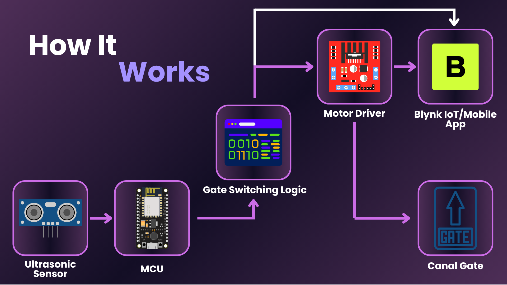
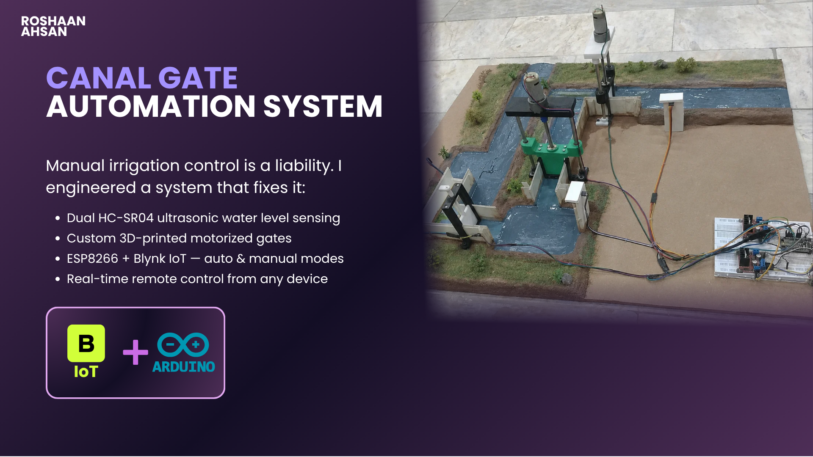
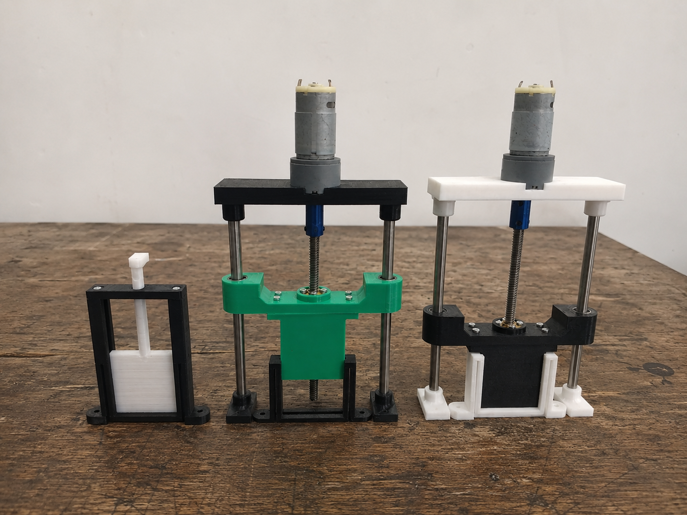
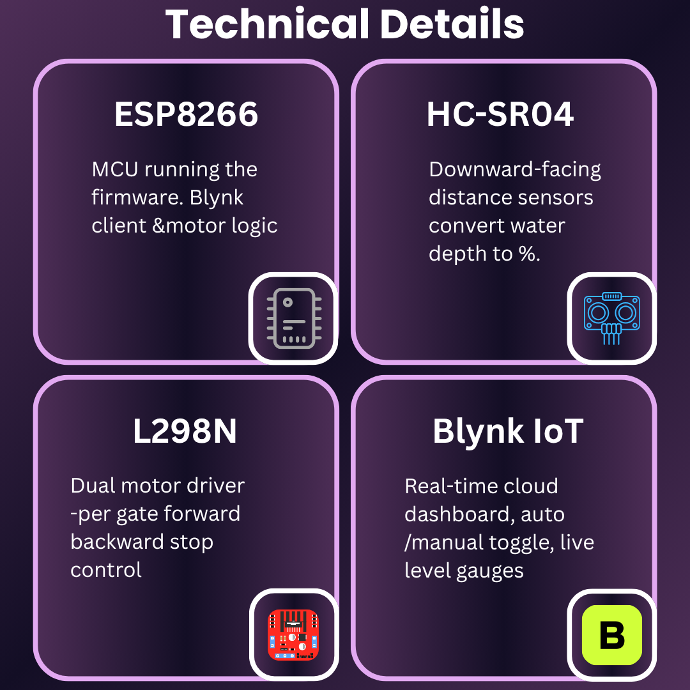
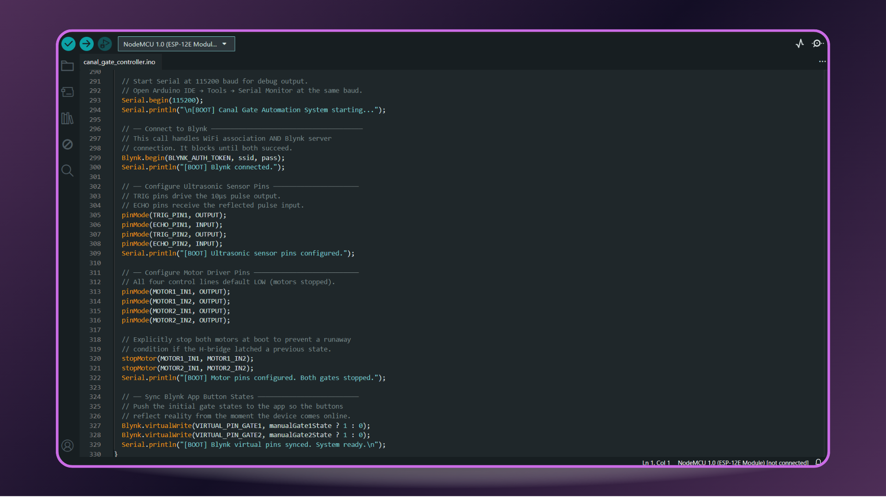
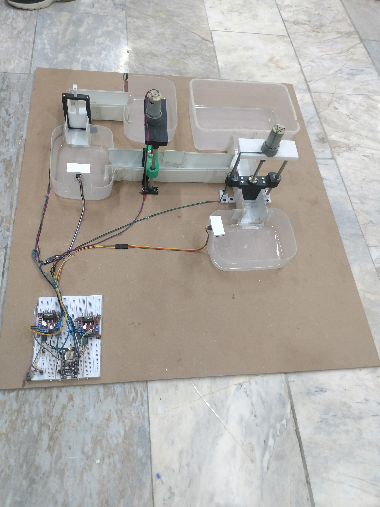
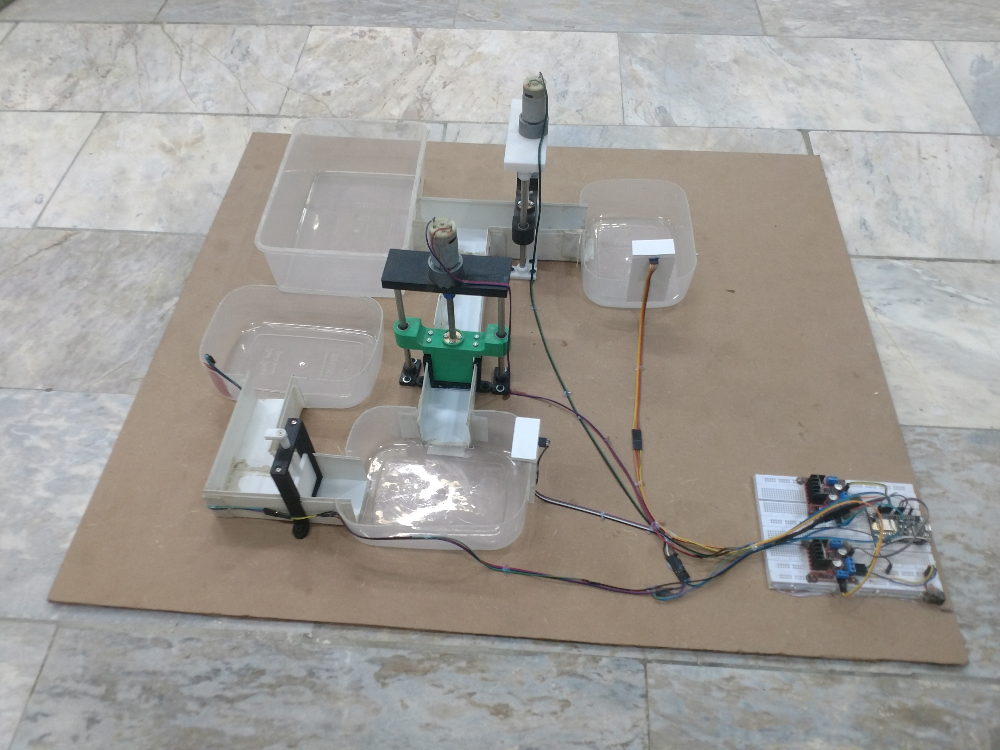

> **Dual-gate canal automation system — ESP8266 reads water levels via HC-SR04 ultrasonic sensors and drives custom 3D-printed motorized gates through L298N H-bridges. Full Blynk IoT remote control with automatic and manual modes.**

---


---

## Executive Summary

Manual irrigation gate control wastes water and labor at scale. This system automates it end-to-end — two HC-SR04 sensors continuously measure canal water levels, an ESP8266 runs threshold logic to decide gate position, and custom 3D-printed motorized gates respond in real time, all visible and controllable from a Blynk mobile dashboard anywhere in the world.

---

## System Architecture



---

## The Problem This Solves

Traditional irrigation canal gates are operated manually — a person physically opens or closes a gate based on visual inspection. This approach fails at scale: it requires constant human presence, reacts slowly to water level changes, and has no remote visibility or override capability. This system replaces the human loop entirely with sensor-driven automation and cloud-connected control, while keeping a manual override available for edge cases.

| Approach | Response Time | Remote Control | Automation |
|---|---|---|---|
| Manual gate operation | Minutes to hours | ✗ | ✗ |
| This system | < 3 seconds | ✓ Blynk IoT | ✓ Threshold logic |

---

## Technical Stack

### Hardware — Silicon Layer

| Component | Spec | Role |
|---|---|---|
| ESP8266 NodeMCU | 80MHz, 802.11 b/g/n WiFi | Main MCU — firmware execution, WiFi, Blynk client |
| HC-SR04 × 2 | 2cm–400cm range, ±3mm accuracy | Water level sensing — downward-facing above canal |
| DC Gear Motor × 2 | 5V–12V DC | Gate actuation via lead-screw mechanism |
| L298N H-Bridge × 2 | 2A per channel, dual channel | Motor direction and speed control |
| Custom 3D-Printed Gates | PLA — lead screw + linear rails | Physical gate body, frame, and travel mechanism |
| Breadboard + wiring | — | Prototyping and circuit integration |

### Firmware


Custom firmware written in C++ on the Arduino framework. Handles dual sensor polling at 10 reads/sec, percentage mapping with inverted distance logic, hysteresis-band threshold engine, motor timing guards, and full bidirectional Blynk sync.

### Cloud Backend


Blynk IoT handles the cloud bridge — the ESP8266 pushes live water level percentages to virtual pin gauges and receives mode toggle and gate override commands from the mobile app in real time.

### Application Layer


Blynk mobile dashboard — live water level gauges for both gates, automation ON/OFF toggle, and individual gate open/close override buttons. Zero custom app code required; all logic lives in the firmware.

---

## Engineering Deep Dive

### The Inverted Sensor Problem

The HC-SR04 sensors mount above the water surface pointing downward. This means the raw distance reading is inversely proportional to water level — a short distance means high water, a long distance means low water. The firmware corrects this with a single map() inversion:

```cpp
// Raw distance → water level percentage (inverted)
// MIN_DISTANCE (24mm) = sensor closest = 100% full
// MAX_DISTANCE (92mm) = sensor farthest = 0% empty
int sensorPercentage = map(distance_mm, MIN_DISTANCE, MAX_DISTANCE, 100, 0);
```

Without this correction, every gate decision would be reversed.

### Hysteresis Band — Preventing Motor Chatter

A naive threshold implementation (open if < 60%, close if > 60%) causes continuous motor oscillation when water level hovers near the trigger point. The solution is a hysteresis band with two separate thresholds:

```cpp
#define OPEN_GATE_THRESHOLD   70   // Close gate above this level
#define CLOSE_GATE_THRESHOLD  50   // Open gate below this level
// Band between 50–70%: no action — gate holds last position
```

This creates a 20% dead band. Once the gate opens (level < 50%), it won't close again until the level rises above 70%. This eliminates rapid toggling and reduces mechanical wear.

### Motor Rest Guard — Mechanical Debounce

Even with hysteresis, rapid sequential commands could damage the lead-screw mechanism. A timing guard enforces a minimum rest period between activations, and direction memory prevents re-issuing the same command:

```cpp
if (openGateCondition &&
    (currentTime - lastMoveTime) > MOTOR_REST_DURATION &&  // 2s minimum rest
    lastDir != BACKWARD) {                                   // Not already open
    moveMotorBackward(motorIn1, motorIn2);
    delay(MOTOR_MOVE_DURATION);   // 1s actuation window
    stopMotor(motorIn1, motorIn2);
    lastMoveTime = millis();
    lastDir = BACKWARD;
}
```

### Auto / Manual Mode Switching

The Blynk V2 toggle switches between modes cleanly. In manual mode, BLYNK_WRITE handlers accept gate commands directly. In auto mode, those same handlers ignore incoming commands — the sensor logic overwrites the button state instead:

```cpp
BLYNK_WRITE(VIRTUAL_PIN_GATE1) {
  if (!automationEnabled) {          // Only act in manual mode
    manualGate1State = param.asInt();
    controlGate(manualGate1State, MOTOR1_IN1, MOTOR1_IN2);
  }
  // In auto mode: silently ignored. Sensor logic controls the button.
}
```

---

## Features

- **Dual Independent Gate Control** — each gate has its own sensor, motor, and logic pipeline
- **Real-Time Blynk IoT Dashboard** — live water level percentages, gate status, mode toggle
- **Automatic Mode** — threshold + hysteresis engine drives gates without human input
- **Manual Override** — full gate control from the Blynk app when automation is off
- **Motor Protection** — 2s rest guard and direction memory prevent mechanical damage
- **Custom 3D-Printed Gates** — lead-screw linear actuator mechanism, fully fabricated
- **Calibration-Ready** — all thresholds, timing constants, and pin assignments in one config block
- **Serial Debug Output** — labeled boot, sensor, motor, and mode events for on-bench diagnostics

---

## UI / Demo

### Main System — Final Diorama Build



### 3D-Printed Gate Mechanisms



*Left: manual gate frame. Centre: motorized gate with green 3D-printed lead-screw carriage. Right: second motorized gate in black/white.*

### Technical Stack



### Firmware — Arduino IDE



### Prototype Build Stages

<table>
  <tr>
    <td width="50%"></td>
    <td width="50%"></td>
  </tr>
  <tr>
    <td align="center"><em>Prototype stage — Gate 1 side, transparent container water test</em></td>
    <td align="center"><em>Prototype stage — Gate 2 side, full breadboard wiring visible</em></td>
  </tr>
</table>

---

## Project Context

Built in 2026 as part of my engineering portfolio. Built to demonstrate a complete hardware-to-cloud automation pipeline — sensor reading, firmware decision logic, physical actuation, and remote IoT control — using off-the-shelf components and custom fabricated mechanical parts.

---

## Contact

[](mailto:roshaanahsan.pro@gmail.com)
[](https://linkedin.com/in/roshaanahsan)
[](https://github.com/roshaanahsan)
[](https://x.com/roshaanahsan)
